<div align="center">

<!-- profile-os:start -->

<!-- profile-os:end -->

### 🐍 Contribution Snake

<picture>
  <source media="(prefers-color-scheme: dark)" srcset="./output/snake.svg"/>
  <source media="(prefers-color-scheme: light)" srcset="./output/snake-dark.svg"/>
  
</picture>

</div>

<br/>

# 🛰️ GitHub Profile OS Generator

An open-source, fully self-hosted generator that turns your GitHub profile
README into a **premium, futuristic developer dashboard** — rendered as a
single animated SVG, redrawn automatically every 24 hours by GitHub
Actions. No SaaS, no external image server, no API keys stored anywhere
but your own repo's secrets.

Everything above this line is generated. Nothing below it is.

## ✨ What it generates

| Component | Description |
|---|---|
| `profile.svg` | The full dashboard — sidebar, terminal, stats, graph, languages, projects |
| Animated terminal | SMIL-typed rotating tagline, boot-style status lines |
| GitHub stats | Contributions, stars, repos, followers + a composite "score" ring |
| Contribution graph | Real calendar heatmap, recolored to the neon theme, glow on hot days |
| Language analytics | Stacked bar + ranked list, computed from your public repos |
| Project cards | Auto-picks your top starred repos (or use a manual list) |
| Profile sidebar | Avatar with neon glow ring, bio, quick links, achievement badges |
| Visitor counter | Live hit counter via CountAPI, baked into the footer strip |
| `snake.svg` / `snake-dark.svg` | A snake that eats its way across your real contribution grid |

## 🧠 How it works

```
generator/
├── config.py              # <- you edit this
├── data_fetcher.py        # talks to the GitHub REST + GraphQL APIs
├── theme.py                # shared gradients / glow filters (<defs>)
├── svg_builder.py          # lays out every panel on the canvas
├── main.py                  # entry point: fetch -> build -> write files
└── components/
    ├── sidebar.py
    ├── terminal.py
    ├── stats.py
    ├── contribution_graph.py
    ├── languages.py
    ├── project_cards.py
    ├── visitor_counter.py
    └── snake.py
```

Each component is a pure function: `(position, size, data, theme) -> SVG string`.
`svg_builder.py` is the only file that knows the absolute layout — so
rearranging the dashboard means editing one file, not hunting through
every component.

The whole pipeline uses **zero third-party Python packages** — only the
standard library (`urllib`, `json`, `xml.sax.saxutils`) — so there's
nothing to install, nothing to patch, and no supply-chain surface.

## 🚀 Quick start

1. **Use this template** (or fork it) into a repo named exactly
   `<your-username>/<your-username>` — the special repo GitHub renders
   on your profile page.
2. Edit [`generator/config.py`](generator/config.py): set your name,
   title, location, links, and typing-animation strings.
3. Push to `main`. The included [workflow](.github/workflows/generate.yml)
   runs immediately, regenerates `output/profile.svg` and
   `output/snake*.svg`, and commits them back.
4. Nothing else to do — it now regenerates every 24 hours automatically,
   pulling fresh stats each time.

### Run it locally

```bash
git clone https://github.com/<you>/<you>.git
cd <you>
export GITHUB_TOKEN=ghp_xxx        # a classic PAT with `read:user` scope is enough
export GH_USERNAME=<you>
python -m generator.main
```

Open `output/profile.svg` in a browser to preview it (SMIL animations run
natively in Chrome/Firefox/Safari, and GitHub's own SVG renderer).

## 🎨 Customizing the theme

All colors, gradients and fonts live in one dict:
[`generator/config.py → THEME`](generator/config.py). Change
`neon_blue` / `neon_purple` / `neon_pink` to retheme every panel at once
— nothing else in the codebase hard-codes a color.

Want a different layout? `generator/svg_builder.py` positions every
panel with plain x/y/w/h math — move a call, change a number, done.

## 🔐 Permissions & secrets

The workflow only needs the default `GITHUB_TOKEN` (already provided by
Actions) with `contents: write` — already set in the workflow file. No
personal access token is required unless you want higher API rate
limits, in which case add a fine-grained PAT as the `GH_TOKEN` repo
secret and it will be picked up automatically.

## 🧩 Extending

Add a new panel by:
1. Creating `generator/components/your_panel.py` with a `build(x, y, w, h, data, theme)` function returning an SVG fragment.
2. Calling it from `generator/svg_builder.py` and giving it a slot on the canvas.

See [`docs/CUSTOMIZATION.md`](docs/CUSTOMIZATION.md) for a full walkthrough,
and [`docs/ARCHITECTURE.md`](docs/ARCHITECTURE.md) for how data flows
through the pipeline.

## 📄 License

MIT — see [`LICENSE`](LICENSE). Fork it, retheme it, ship it as your own.
