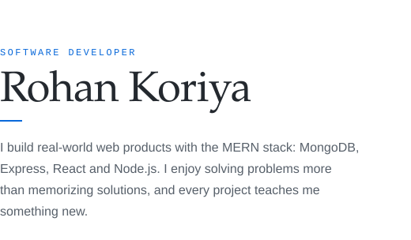

<!-- PROFILE:START -->
<!-- Generated by generator/ — edit profile.toml, not this block. -->

<picture>
  <source media="(prefers-color-scheme: dark)" srcset="generated/hero-portrait-dark.svg">
  
</picture>
<picture>
  <source media="(prefers-color-scheme: dark)" srcset="generated/hero-text-dark.svg">
  
</picture>
 
<a href="https://github.com/RohanKoriya">GitHub&nbsp;↗</a> &nbsp;·&nbsp; <a href="https://www.linkedin.com/in/rohankoriya/">LinkedIn&nbsp;↗</a> &nbsp;·&nbsp; <a href="mailto:koriyarohan123@gmail.com">Email&nbsp;↗</a>
 

 

<picture>
  <source media="(prefers-color-scheme: dark)" srcset="generated/activity-dark.svg">
  
</picture>

<picture>
  <source media="(prefers-color-scheme: dark)" srcset="generated/overview-dark.svg">
  
</picture>

<picture>
  <source media="(prefers-color-scheme: dark)" srcset="generated/stack-dark.svg">
  
</picture>

<picture>
  <source media="(prefers-color-scheme: dark)" srcset="generated/projects-head-dark.svg">
  
</picture>
<a href="https://github.com/RohanKoriya/sample-project-one">
<picture>
  <source media="(prefers-color-scheme: dark)" srcset="generated/project-1-dark.svg">
  
</picture>
</a>
<a href="https://github.com/RohanKoriya/sample-project-two">
<picture>
  <source media="(prefers-color-scheme: dark)" srcset="generated/project-2-dark.svg">
  
</picture>
</a>
<a href="https://github.com/RohanKoriya/sample-project-three">
<picture>
  <source media="(prefers-color-scheme: dark)" srcset="generated/project-3-dark.svg">
  
</picture>
</a>

 

<picture>
  <source media="(prefers-color-scheme: dark)" srcset="generated/snake-dark.svg">
  
</picture>

<picture>
  <source media="(prefers-color-scheme: dark)" srcset="generated/footer-dark.svg">
  
</picture>
<!-- PROFILE:END -->
